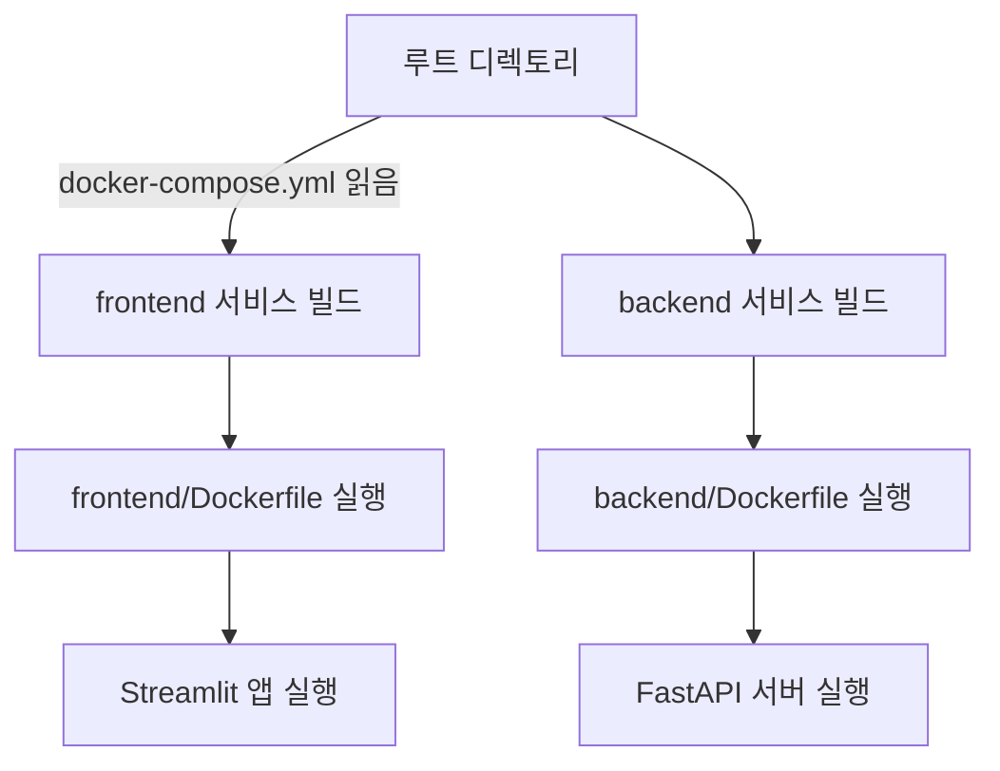

# 목표

Backend(FastAPI) + Frontend(Streamlit) 을  `docker-compose`로 통합구성하여 개발/배포 환경을 일관되게 유지할수 있게 하고, 서로 다른 컨테이너 간의 네트워크 연결을 해볼것.

[참조파일 : docker document](https://docs.docker.com/build/concepts/dockerfile/)

## 1. 목표구조

```bash

.
├── backend/
│   ├── main.py
│   ├── requirements.txt
│   ├── .env
│   └── Dockerfile           
├── frontend/
│   ├── app.py
│   ├── requirements.txt
│   └── Dockerfile           
├── docker-compose.yml       
└── README.md     
```

## 2. backend/Dockerfile

```Dockerfile

# backend/Dockerfile
FROM python:3.11

WORKDIR /app

COPY requirements.txt .
RUN pip install --no-cache-dir -r requirements.txt

COPY . .

CMD ["uvicorn", "main:app", "--host", "0.0.0.0", "--port", "8000"]
```

## 3. frontend/Dockerfile

```Dockerfile

# frontend/Dockerfile
FROM python:3.11

WORKDIR /app

COPY requirements.txt .
RUN pip install --no-cache-dir -r requirements.txt

COPY . .

CMD ["streamlit", "run", "app.py", "--server.port=8501", "--server.address=0.0.0.0"]
```

## 4. docker-compose.yml

```yaml

version: '3.9'

services:
  backend:
    build:
      context: ./backend
    container_name: fastapi-backend
    ports:
      - "8000:8000"
    env_file:
      - ./backend/.env
    networks:
      - app-network

  frontend:
    build:
      context: ./frontend
    container_name: streamlit-frontend
    ports:
      - "8501:8501"
    environment:
      - BACKEND_URL=http://backend:8000/generate-music/
    depends_on:
      - backend
    networks:
      - app-network
networks:
  app-network:
    driver: bridge
```

## 5. 실행방법

```bash
$ docker-compose up --build
```

## 6. 접속주소

  - frontend : http://localhost:8501
  - backend : http://localhost:8000/docs

## 7. 옵션

  - 로그확인 : docker-compose logs -f frontend
  - 개별접속 : docker exec -it fastapi-backend bash
  - 중지 : docker-compose down


## 8. 작동흐름



## 9.QA

> docker-compose.yml을 왜 루트 디렉토리에서 실행하는가? <br>
: `docker-compose.yml`은 상대경로로 `build context`를 지정하기 때문에 `context: ./backend`와 `context: ./frontend`가 제대로 작동위해선 그 기준점인 루트 경로에서 실행해야 함.

[맨 위로 이동하기](#){: .btn .btn--primary }{: .align-right}