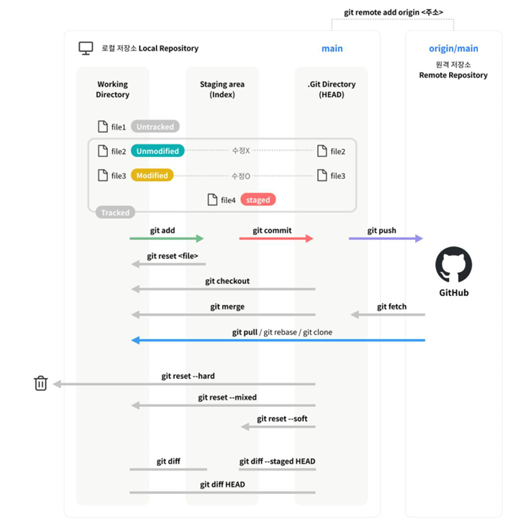

# git command



## 1. git 초기화 및 원격 저장소 연결 후 푸쉬하기

```bash
# 1. Git 초기화 : git local 저장소 초기화
git init  

# 2. 원격저장소 연결 : origin은 github원격저장소 이름을 지정함.
git remote add origin https://xxxxxx.git    

# 3. git에 추가 : directory를 스테이징
git add directory 

# 4. 커밋
git commit -m "xxx"  

# 5. 태그 붙이기
git tag v0.1  


# 6. Github에 업로드 : main branch 푸쉬

git branch -M main  # 현재 브랜치 이름을 'main'으로 강제 변경(Move)한다는 의미
git push -u origin main  # 의미) git에 origin이라는 remote저장소에 main브랜치 생성하여 푸쉬해라.

# 7. 태그 푸시
git push origin v0.1 
```

  - git branch -M main  
    - M : 이미 존재하는 브랜치 이름과 충돌하더라도 강제로 변경함.
  - git push -u origin main  
    - `-u`또는 `--set-upstream`  : 이 브랜치를 이후부터 기본으로 연결하겠다는 뜻 (즉, 이후엔 `git push`만 해도 `origin main`로 푸시됨.)
    - `origin`저장소에 `main`브랜치가 생성되고 업로드됨.

## 2. .git 구조 파악하기??
`.git` 디렉토리는 Git 저장소 자체의 핵심 설정 및 기록을 담고 있는 폴더

  - `.git`은 항상 하나의 루트 폴더에만 존재해야함.


## 3. commit 메세지 작성방법론 (conventional commits방법론)

| 타입 | 설명 | 예시 |
| --- | --- | --- |
| feat | 새로운 기능 추가 | 사용자 로그인 기능 추가 |
| fix | 버그 수정 | 로그인 시 비밀번호 오류 수정 |
| docs | 문서 관련작업 (README 등) | README에 설치 방법 추가 |
| style | 포맷팅, 세미콜론 누락 등 | 코드 포맷팅(prettier적용) | 
| refactor | 리팩토링(기능변경 없음) | API응답 구조 정리 |
| test | 테스트 추가 또는 수정 | 로그인 유닛 테스트 추가 | 
| chore | 설정파일, 빌드 작업 등 기타 작업 | Gitignore설정 추가 |

  - `why`를 설명하여 적을것
  - ex) 

    ```bash
    git commit -m "feat: Release v0.2
    - Added OpenCV webcam integration
    - Implemented real-time Mediapipe skeleton detection
    - Initial version of streamlit frontend"
    ```


## Git 로그인에 PAT사용 및 권한설정

| 인증질문 | 의미 및 해결책 |
| --- | --- |
| username | 본인의 GitHub 계정 ID |
| password | PAT(Personal Access Token)사용 |

> Personal Access Token(PAT)만들기 <br>
1. github 접속 > setting > developer setting > personal access token 접속
2. Fine-grained tokens 선택
3. Generate new token 선택
4. 사용목적 선택 : `repo`, `workflow`, `write` 권한 체크
5. 토큰생성

## ssh접근방식은???


## branch변경

```bash
# 1. 현재 브랜치 확인
git branch

# 2. 브랜치 이름 변경 ( Master -> main)
git branch -m master main    # -m : 현재 브랜치의 이름을 master -> main으로 이름 변경

# 3. 브랜치 이름 새로 만들기(아직 없을때)
git checkout -b main

# 4. 원격저장소(GitHub)의 `main` 브랜치에 푸시하고 싶다면?
git push -u origin main # 로컬에서 만든 main 브랜치를 GitHub에도 main이라는 이름으로 푸시하겠다는 의미.
```

## remote주소 확인

```bash

# 1. 현재 remote 주소확인
git remote -v

# 2. remote 주소 변경하기
git remote set-url origin [새로운주소] # http나 ssh버전 둘다 가능.

# 3. remote 이름 바꾸고 싶다면?
git remote rename origin uptream

# 4. remote를 새로 추가하고 싶다면?
git remote add origin [주소]
```


## 커밋수정 4가지 방법 : amend

```bash
# 1. 최근 커밋 메시지만 바꾸기
# 이전 커밋 메시지를 새 메시지로 덮어씀.
# 아직 git push 전이라면 안전하게 사용 가능
git commit --amend -m "fix: 오타수정" 

# 2. 커밋한 파일 내용도 바꾸기
vim main.py # 파일 내용 직접 수정
git add main.py # 다시 스테이지에 올리기
git commit --amend #기존 커밋에 덮어쓰기

# 3. 이미 푸시한 커밋도 수정  : 히스토리 덮어쓰기!(주의필요)
git commit --amend
git push --force

# 4. 여러개 전 커밋까지 수정
git rebase -i HEAD~3  # 마지막 3개의 커밋을 목록으로 불러옴.
                      # 원하는 커밋을 edit 또는 reword로 바꿔서 수정 가능
```

## push 원복방법 : reset(혼자작업) & revert(협업)

```bash

# 1. 가장 최근 push를 원복하고 싶을때(잘못된 커밋이 1~2개이고, 전부 취소해도 괜찮을때)
git reset HEAD~1 # 최근 커밋1개 취소하고, 변경사항은 로컬에 유지
git reset --hard HEAD~1 # 변경사항을 완전히 버리고 싶다면.
git push origin main --force # 원격 저장소도 동일하게 덮어쓰기 (주의 : 다른 사람 작업도 지워질수 있음)

# 2. 특정 commit으로 원복하기
git log --oneline # 커밋 히스토리 확인
git reset --hard [커밋ID]   # 원하는 커밋ID로 이동
git push origin main --force  # 원격저장소도 해당 상태로 덮어쓰기

# 3. 커밋만 남기고 변경사항 되돌리고 싶을때 (히스토리 보존하므로 협업시 안전함.)
git revert [커밋ID] # 잘못된 커밋 되돌리기
git push origin main  # 변경사항 되돌린 커밋이 새로 생김.
```

## 에러상황대처

### 진단명령어

```bash

# 1. 현재 git 상태 확인
git status

# 2. 현재 체크아웃된 브랜치 이름 확인
git branch --show-current

# 3. 로컬/원격 브랜치 목록 확인
git branch -a

# 4. HEAD가 어떤 ref를 가리키는지 확인(예 : ref:refs/heads/master)
cat .git/HEAD

# 5. 실제 브랜치 ref파일들 확인
ls -la .git/refs/heads

```


[맨 위로 이동하기](#){: .btn .btn--primary }{: .align-right}