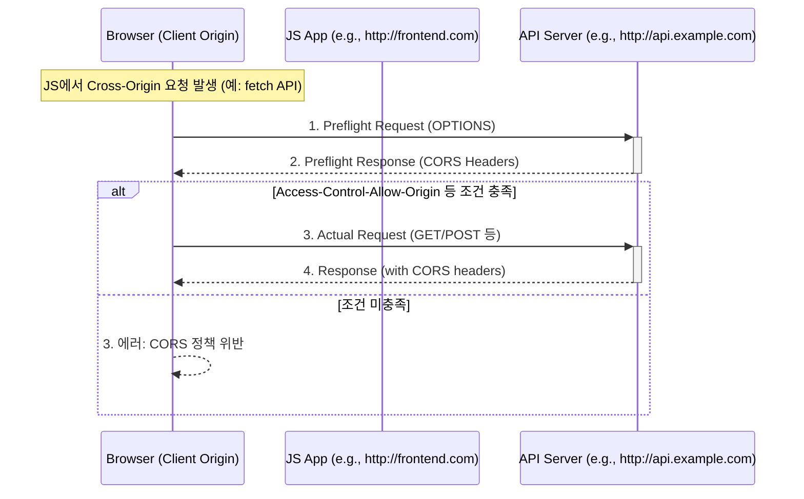

## 1. FastAPI에서 CORS 해결하기

```
from starlette.middleware.cors import CORSMiddleware

origins=[
  "*"
]

app.add_middleware(
  CORSMiddleware,
  allow_origins=origins,
  allow_credentials=True,
  allow_methods=["*"],
  allow_headers=["*"],
)

if __name__ == "__main__":
    uvicorn.run(app, host="0.0.0.0")
```

  - 모든 URL에 허용해주기 위해 origin에 "*"을 넣음.
  - 만약 Frontend URL을 지정해주고 싶다면?
  ```
  origins = [
    "frontend-app.yourdomain.com",
    "frontend-app2.yourdomain.com:7000"
    " <ip-address>:<port> "
  ]
  ```
- FastAPI의 응답헤더에 Cross-Origin을 허용한다는 정보를 추가하여, 브라우저가 각기다른 URL로부터 받은 응답을 조합하여 웹페이지를 표현하는데 문제없도록 하는것.

## 2. CORS란?
: Cross-Origin Resource Sharing

- CORS는 브라우저에서 동작하는 보안 메커니즘.
- 서로 다른 출처(도메인, 프로토콜, 포트)에서 리소스를 공유할 수 있도록 하는 웹 보안 메커니즘
- 웹페이지에서 다른 출처의 API나 리소트에 접근하려 할 때 발생할 수 있는 Same-Origin Policy(단일 출처 정책) 제한을 우회하여 리소스 접근을 허용하거나 거부하는 역할을 함.
- 브라우저에서는 보안적인 이유로 **cross-origin** HTTP요청들을 제한함. 그래서 **cross-origin**요청하기 위해선 서버의 동의가 필요.
- 만약 서버가 동의한다면 브라우저에서는 요청을 허락 / 동의하지 않으면 브라우저에서 거절
- 이러하 허락을 구하고 거절하는 메커니즘을 HTTP-header를 이용해서 가능함. 이를 CORS라고 부름.
- 즉, 브라우저에서 **cross-origin**요청을 안전하게 할수 있도록 하는 메커니즘. 



1. 문제 : same-origin policy란?
  - 웹 보안의 핵심 원칙중인 SOP(same-origin policy)는 브라우저가 스크립트가 로드된 출처와 동일한 출처에만 요청을 허용함.
  - 해당 정책은 보안을 위해 필수지만, 실제 서비스 환경에서는 frontend와 backend가 분리되어 다른 origin 에서 동작하는 경우가 많아 SOP는 오히려 유연한 통신의 장애물이 됨.

> 출처란? <br>
protocol, domain, port가 동일해야 같은 출처로 간주됨.

2. 해결책 : CORS
  - CORS는 HTTP header 기반의 명시적 허용 시스템.
  - 서버가 브라우저에게 "내가 이 origin에서 온 요청을 허용한다"는 것을 알려줌.

3. CORS의 요청 종류

| 구분                    | 설명                                 | 예시                                                                       |
| --------------------- | ---------------------------------- | ------------------------------------------------------------------------ |
| **Simple Request**    | 브라우저가 즉시 요청                        | `GET`, `POST`(with `application/x-www-form-urlencoded`, `text/plain`, 등) |
| **Preflight Request** | 민감하거나 복잡한 요청의 경우 사전 검사(OPTIONS) 요청 | `PUT`, `DELETE`, `Content-Type: application/json` 등                      |

4. Preflight request 흐름
  - 4-1. 브라우저는 서버에 먼저 `option` 요청을 보냄 : 이 origin에서 오는 실제 요청을 수락할 건지 확인
  - 4-2. 서버는 CORS관련 헤더를 통해 이를 제어하며, 정확한 설정 없이는 요청 자체가 실패
    - Access-Control-Allow-Origin : http://frontend.com
    - Access-Control-Allow-Methods : GET, POST
    - Access-Control-Allow-Headers : Content-Type, Authorization
    - Access-Control-Allow-Credentials : True
  - 4-3. 브라우저는 응답을 분석한 뒤, 조건이 만족되면 실제 요청을 보냄.

5. 실제 요청과 응답
  - 브라우저는 본 요청(GET/POST등) 을 다시 보냄.
  - 서버는 요청을 처리하고 응답을 반환하면서 다시 CORS 관련 헤더를 포함시켜야 함.
    - 그렇지 않으면 브라우저는 보안 정책상 응답을 무시함.


[맨 위로 이동하기](#){: .btn .btn--primary }{: .align-right}
 

